# 📠 Scan to Paperless Bridge

[](https://github.com/hensing/scan-to-paperless/actions/workflows/docker-publish.yml)


**Author:** Dr. Henning Dickten ([@hensing](https://github.com/hensing))

A lightweight, secure, and Dockerized bridge designed for **Raspberry Pi** and generic Linux servers. It provides a Samba (SMB) share for hardware document scanners.

Once a scan is saved to the share, this container detects the completed file, uploads it directly to **Paperless-ngx** via API, and optionally archives or cleans up the local file.

---

### 🔄 How it works

```mermaid
graph LR
    A[🖨️ Hardware Scanner] -- SMB (Port 445) --> B(📂 /inbox)
    B --> C[🐳 Container Watcher]
    C -- API Token --> D[📄 Paperless-NGX]
    C -- Move/Delete --> E(📦 /archive)
```



## ✨ Features

- **🚀 Multi-Arch Support:** Optimized for `linux/amd64` and `linux/arm64` (Raspberry Pi).
- **🔒 Secure by Default:** Binds to privileged SMB port 445 but drops privileges to run as a non-root user (configurable `PUID`/`PGID`).
- **📂 Samba Integration:** Built-in SMB server compliant with modern scanners.
- **⚡ Smart Detection:** Uses `inotify` to detect `close_write` events (prevents processing incomplete files).
- **🏷️ Auto-Tagging:** Automatically apply tags to uploaded documents.
- **🧹 Auto-Cleanup:** Options to archive or delete files after successful upload.
- **🛡️ SSL Support:** Full support for HTTPS and self-signed certificates.

## 🔗 Recommended Workflow

This tool works best as part of a modern document management ecosystem. We highly recommend checking out:

* **[Paperless-ngx Documentation](https://docs.paperless-ngx.com/)**: The official documentation for the backend system.
* **[Paperless-GPT](https://github.com/icereed/paperless-gpt)**: An amazing tool to add AI-powered analysis, tagging, and renaming to your documents after they have been uploaded.

## 🚀 Quick Start

### 1. Configuration

Create your `.env` file based on the example:

```bash
cp .env.example .env
```

**Minimal `.env` example:**

```dotenv
PAPERLESS_URL=[https://paperless.local:8000](https://paperless.local:8000)
PAPERLESS_API_KEY=your-super-secret-token
SMB_USER=scanner
SMB_PASSWORD=scan123
PUID=1000
PGID=1000
```

### 2. Docker Compose

Create a `docker-compose.yml` (or use the one provided):

```yaml
services:
  scan-to-paperless:
    image: ghcr.io/hensing/scan-to-paperless:latest
    container_name: scan-to-paperless
    restart: unless-stopped
    ports:
      - "445:445" # Standard SMB port
    env_file:
      - .env
    volumes:
      - ./data:/data
```

Start the container:

```bash
docker compose up -d
```

### 3. Scanner Setup

Configure your physical scanner (Brother, Canon, HP, etc.) with these settings:

* **Protocol:** SMB / CIFS
* **Server:** IP of your Docker host
* **Port:** 445
* **Share Name:** `scanner` (default)
* **Username:** `scanner` (default)
* **Password:** `scan123` (default)

---

## ⚙️ Configuration Reference

### Application Settings

| Variable | Description | Default | Required |
| :--- | :--- | :--- | :---: |
| `PAPERLESS_URL` | Full URL to Paperless-NGX (e.g., `http://192.168.1.5:8000`) | - | ✅ |
| `PAPERLESS_API_KEY` | API Token (Get it from Paperless Settings → API Tokens) | - | ✅ |
| `PAPERLESS_TAGS` | Comma-separated tags to apply (e.g., `inbox,scanned`) | `""` | ❌ |
| `PAPERLESS_VERIFY_SSL`| Verify SSL certificates (`false` for self-signed) | `true` | ❌ |
| `WHITELIST` | Allowed file extensions | `pdf,jpg,png,bmp` | ❌ |
| `ARCHIVE` | `true` = Move to archive folder, `false` = Delete after upload | `true` | ❌ |
| `UPLOAD_TIMEOUT` | Max time (seconds) for API upload | `30` | ❌ |
| `SCAN_SETTLE_TIME` | Seconds to wait after detection before upload | ̀ 5` | ❌ |

### Samba & User Settings

| Variable | Description | Default |
| :--- | :--- | :--- |
| `SMB_USER` | Username for the scanner to login | `scanner` |
| `SMB_PASSWORD` | Password for the scanner | `scan123` |
| `SMB_SHARE` | Name of the SMB share | `scanner` |
| `PUID` | User ID to run as (matches host user) | `1000` |
| `PGID` | Group ID to run as (matches host group) | `1000` |

> **Note on Permissions:** This container starts as root to fix volume permissions on `./data` and bind port 445, but immediately drops privileges to the user specified in `PUID`/`PGID`.

---

## 📂 Directory Structure

The container expects a volume mounted to `/data`. It will automatically create the following structure:

```text
/data
├── inbox/      <-- Scanner saves files here (Monitored)
└── archive/    <-- Processed files are moved here (if ARCHIVE=true)
```

## 🛠️ Troubleshooting

**🛑 "Upload failed" in logs**
* Check if `PAPERLESS_URL` is reachable from inside the container.
* Verify `PAPERLESS_API_KEY`.
* If using a self-signed cert, try setting `PAPERLESS_VERIFY_SSL=false`.
* Increase `SCAN_SETTLE_TIME`. Some network scanners report "finished" before the file is fully flushed to the disk.

**🚫 Scanner cannot connect (Network Error)**
* Ensure port **445** is not blocked by a firewall on the host.
* Windows/Mac hosts might use port 445 for their own sharing service. Ensure port 445 is free or use a different external port (note: many scanners hardcode 445).

**📄 File is ignored**
* Check the `WHITELIST` in `.env`.
* The container waits for the `close_write` event. Ensure the scanner finishes writing the file completely.

---

## 🤝 How to Contribute

Contributions, improvements, and bug fixes are welcome!

1. Fork the project.
2. Create your feature branch (`git checkout -b feature/AmazingFeature`).
3. Commit your changes (`git commit -m 'Add some AmazingFeature'`).
4. Push to the branch (`git push origin feature/AmazingFeature`).
5. Open a Pull Request.

**Note to Forks:** Please ensure that the original author credit remains intact in the license and documentation when forking or redistributing this project.

## 👨‍💻 Development

Build the image locally:

```bash
docker build -t scan-to-paperless .
```

## 📜 License

Distributed under the MIT License. See [LICENSE](LICENSE) for more information.